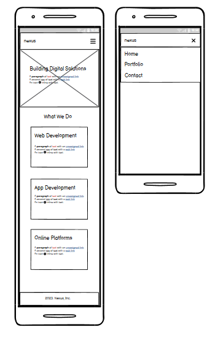
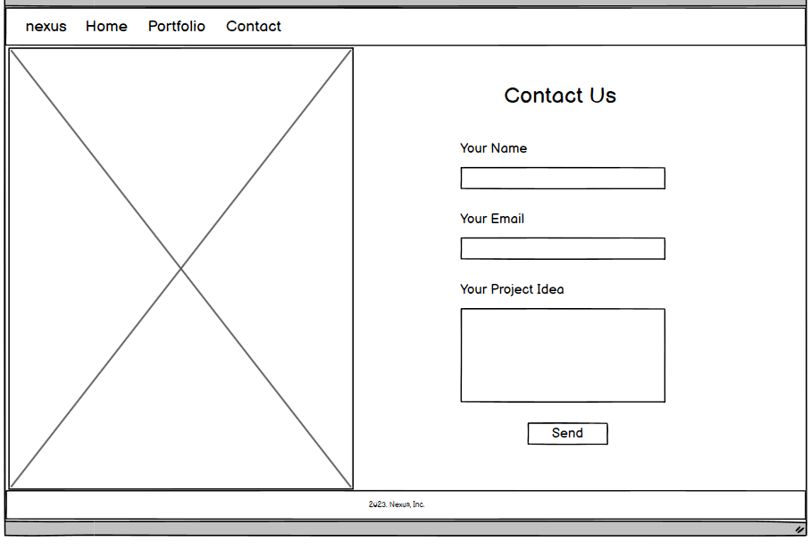
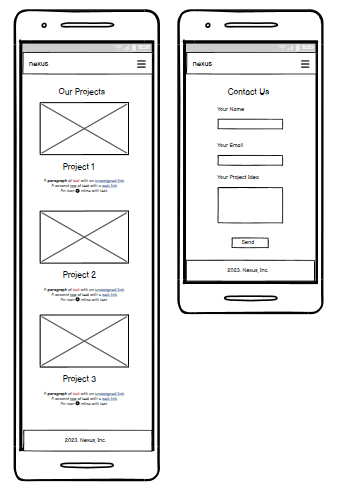
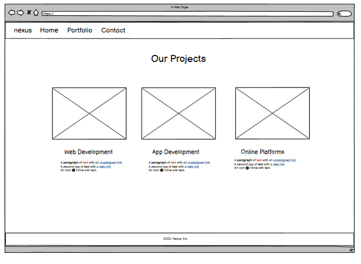
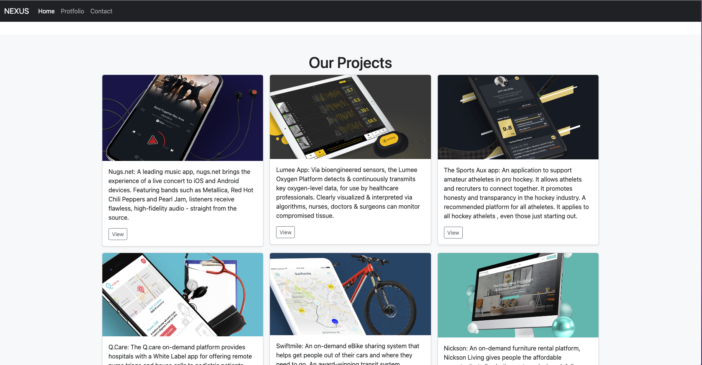
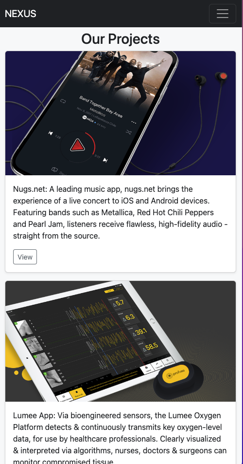

<h1 align="center">Nexus Software Development</h1>

[View the live project here.](https://xalil404.github.io/nexus/index.html)

This is the main marketing website for the Nexus Software development team. It is designed to be responsibe and accessible on a range of devices, making it easy to navigate for potential customers. It will include a landing, portfolio and contact page. Our goal is to create an interactive website for a software dev company.

## User Experience (UX)

- ### User stories

- #### First Time Visitor Goals

        1. As a First Time Visitor, I want to easily understand the main purpose of the site and learn more about the company.
        2. As a First Time Visitor, I want to be able to easily navigate throughout the site to find content.
        3. As a First Time Visitor, I want to look for portfolios to see examples of work done by the company and devs.

- #### Returning Visitor Goals

        1. As a Returning Visitor, I want to find information about hiring or contracting the company.
        2. As a Returning Visitor, I want to find the best way to get in contact with the company with any questions I may have.
        3. As a Returning Visitor, I want to find up to date portfolios and contact information.

- #### Frequent User Goals

        1. As a Frequent User, I want to check to see if there are any newly added services or developers.
        2. As a Frequent User, I want to check to see if there are any new portfolios added.
        3. As a Frequent User, I want to be kept updated on the companies work availability.

- ### Design

       - The two main colours used are black, grey, and white.
       - The font used is arial

- ## Wireframes

Click here to view Wireframes

 

- Desktop Home Page - 

- Mobile Home Page - 

- Desktop Contact Page - 

- MobileContact Page - 

- Portfolio Page - 

## Structure

- Live Portfolio Page - 

- Live Mobile Page - 

## Technologies Used

### Languages Used

- [HTML5](https://en.wikipedia.org/wiki/HTML5)
- [CSS3](https://en.wikipedia.org/wiki/Cascading_Style_Sheets)
- [Python](https://en.wikipedia.org/wiki/Python_(programming_language))
- [JavaScript](https://en.wikipedia.org/wiki/JavaScript)

### Frameworks, Libraries & Programs Used

1. [Bootstrap 4.4.1:](https://getbootstrap.com/docs/4.4/getting-started/introduction/)
    - Bootstrap was used to assist with the basic layout.
2. [GitHub:](https://github.com/)
    - GitHub is used to store the projects code after being pushed from Git.
3. [Balsamiq:](https://balsamiq.com/)
    - Balsamiq was used to create the wireframes during the design process.

- #### First Time Visitor Goals

    1. As a First Time Visitor, I want to easily understand the main purpose of the site and learn more about the organisation.

        1. Upon entering the site, users are automatically greeted with a clean and easily readable navigation bar to go to the page of their choice.
        2. The main goal is to help steer potential customers to the information that they need.
        3. The user has many options on the landing page, from viewing portfolios to getting contact information

    2. As a First Time Visitor, I want to be able to easily be able to navigate throughout the site to find content.

        1. The site has been designed to be fluid and never to entrap the user. At the top of each page there is a clean navigation and search bar, each link describes what the page they will end up at clearly.
        2. At the bottom of each page there is a footer with terms of service and copy right information
        3. On the Contact Us Page, after a form response is submitted, the page refreshes and the user is brought to the top of the page where the navigation bar is.

    3. As a First Time Visitor, I want to view portfolios and to understand what the company offers. I also want to locate their social media links to see their following on social media to determine how trusted and known they are.

        1. Once the new visitor has read the landing page they will know which section they want to view next.
        2. The user can also scroll to the bottom there is a link to smoothly take them back to the top.
        3. On the contact page the user will have all the information they need to make a query.

- #### Returning Visitor Goals

    1. As a Returning Visitor, I want to see the available options for business.

        1. These are clearly shown in the landing page.
        2. They will be directed to either the portfolios or contact page depending on where they want to go.

    2. As a Returning Visitor, I want to find the best way to get in contact with the organisation with any questions I may have.

        1. The navigation bar clearly highlights the "Contact Us" Page.
        2. Here they can fill out the form on the page or are told that alternatively they can message the organisation on social media.
        3. The form is set up to automatically open up your email app and autofill there email address in the appropriate section.

    3. As a Returning Visitor, I want to find up to date information
        1. If the user is on the "Portfolio" page they will also be presented with our devs and various portfolios.

- #### Frequent User Goals

    1. As a Frequent User, I want to check to see if there are any newly added devs or portfolios.

        1. The user would already be comfortable with the website layout and can easily click the section they want.

    2. As a Frequent User, I want to check to see if there are any new business posts.

    3. As a Frequent User, I want to be able to easily contact the business
        1. There is a "Submit" button to the right hand side of the input field which is located close to the field and can easily be distinguished.

## Credits

### Content

- All content was written by the developers.
- [Bootstrap4](https://getbootstrap.com/docs/4.4/getting-started/introduction/): Bootstrap template used for basic home page layout.

### Media

- All Images were created by the developers.
